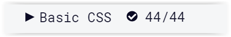

# 100 Days Of Code - Log

### Day 1: November 6, Wednesday

**Today's Progress**: Completed the Basic HTML and HTML5 section in the Responsive Web Design Certification

**Thoughts** I already knew the content in this section but my objective is to go through everything, leaving no stone unturned. I expect as time progresses and I get into the groove I'll be able to churn out more in less time.

**Link(s) to work** (N/A)

### Day 2: November 7, Thursday

**Today's Progress**: Completed the Basic CSS section in the Responsive Web Design Certification

**Thoughts** There were a few things I hadn't used before but had some familiarity with from before. I did my hour today, but didn't complete all the lesson until the early hours of Day 3. I'm looking forward to learning animations and enhancing my design skills. I need to manage distractions better, but overall I'm happy with my progress.

**Link(s) to work** (N/A)

### Day 3: November 8, Thursday

**Today's Progress**: Actually completed the Basic CSS section and made significant progress in the Applied Visual Design section in the Responsive Web Design Certification

**Thoughts** I've been putting in most of my work in the 10pm to 3-4am timeframe EST. This means my hour a day tends to merge across days. I hadn't completed the Basic CSS track but wrapped it up early the next morning. I've been distracted or redirecting energy to other activities besides freecodecamp but am definitely using the time more productively than my null days so that's not entirely negative.
Watched/Listened to the following 
*https://syntax.fm/show/194/potluck-gatsby-vs-next-is-google-home-spying-on-you-flat-file-cms-css-frameworks-hosting-client-sites-more
*https://codequs.com/p/S1CDckwEr/javascript-who-what-where-why-and-next

**Link(s) to work** (N/A)

### Day 4: November 9, Friday

**Today's Progress**: Did some work on my personal project that I developed a few years ago.

**Thoughts** Focus was shifted from freecodecamp again to work on fixing my Chrome Extension to add it to my portfolio. This also involved migrating the FAQ from an old Azure Dev Ops company repository to my personal github pages live site. While this wasn't learning directly I enjoyed getting back into the swing of thing and learning about what had changed with the tooling and environments since I've been out. No serious roadblocks yet so I'm thankful.

Link(s) to work
1. https://dalevross.github.io/OWLS_Word_Games_Enhancer.html
2. https://tinyurl.com/free-tracker

